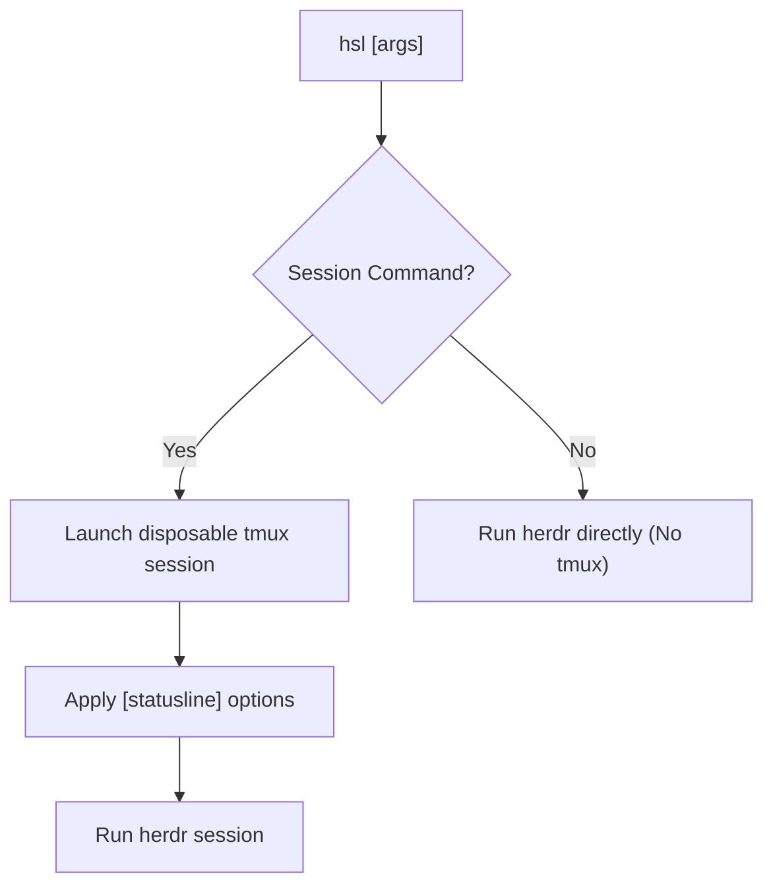

# herdr-statusline

[](https://opensource.org/license/mit/)
[](https://github.com/iiii1224/herdr-statusline)
[](#requirements)

Customizable status line for `herdr` sessions.


> `herdr-statusline` (`hsl`) wraps `herdr` sessions inside a disposable tmux status line. Utility commands bypass tmux completely and run `herdr` directly, keeping overhead minimal.

---

## Requirements

- **OS:** Linux or WSL
- **Herdr:** 0.7.5 or later
- **tmux:** required for `hsl` statusline commands
- **Cargo:** required at install time (recent stable Rust toolchain)

---

## Installation & Quick Start

### Install

Run the following command using `herdr`:

```sh
herdr plugin install iiii1224/herdr-statusline
```

Make sure `~/.local/bin` is in your `PATH`.

### Usage

Use `hsl` wherever you would use `herdr`:

```sh
hsl                      # Starts session with custom status line
hsl --session dev        # Attach to session 'dev' with status line
```

### Update

Re-run the installation command:

```sh
herdr plugin install iiii1224/herdr-statusline
```

Your `config.toml` and custom scripts will not be overwritten.

### Uninstall

```sh
hsl uninstall           # Removes the plugin and hsl executable; preserves config
hsl uninstall --purge   # Removes the plugin and deletes the config directory
```

---

## Configuration

Find your plugin configuration directory using:

```sh
herdr plugin config-dir herdr-statusline
```

Running `hsl` for the first time automatically generates `config.toml` and an example helper script `herdr-info.sh` in that directory.

### `config.toml` Example

```toml
enabled = true

[statusline]
status_interval = 1
status_justify = "centre"
status_style = "bg=colour238,fg=colour255"
status_left_length = 120
status_left = "#($HERDR_PLUGIN_CONFIG_DIR/herdr-info.sh)"
status_right_length = 60
status_right = "#[fg=colour255,bg=colour241] #h | LA: #(cut -d' ' -f-3 /proc/loadavg) | %m/%d %H:%M:%S#[default]"
window_status_format = " #I: #W "
window_status_current_format = "#[fg=colour255,bg=colour27,bold] #I: #W #[default]"
```

### Statusline Options & Environment Variables

- Options under `[statusline]` map directly to tmux status settings (`status`, `status-*`, and `window-status-*`). Write option names using underscores in `config.toml` (e.g., `status_style`, `window_status_format`), which are automatically converted to hyphens for tmux.
- Inside `#(...)` shell commands, two environment variables are available:
  - `$HERDR_SESSION`: The current Herdr session name.
  - `$HERDR_PLUGIN_CONFIG_DIR`: Path to the plugin configuration directory.

### Multiple Status Lines

`status` takes `on`, `off`, or `2`–`5`. Lines past the first are drawn from tmux's `status-format[N]`, written `status_format_N`:

```toml
status = 2
status_format_1 = "#[align=left]#($HERDR_PLUGIN_CONFIG_DIR/herdr-info.sh)"
```

- Line 0 keeps tmux's default format, which is what composes `status_left`, `status_right`, `status_left_length` and the window list. Setting `status_format_0` replaces it, and those options stop having any effect.
- Without a `status_format_N` of your own, line 1 shows tmux's pane list and line 2 its session list — both near-empty in the single-pane session `hsl` creates.
- Each extra line takes a row from the `herdr` pane.

### Herdr integration with the tmux status line

The generated `herdr-info.sh` is an example of how to integrate Herdr with
the tmux status line. It reads the focused pane from `herdr pane current` and
renders that pane's id, its working directory, and its Git branch and working-tree
state. To turn it on, uncomment these three lines in the generated `config.toml`:

```toml
status_style = "bg=#242424,fg=#dadada"
status_left_length = 120
status_left = "#($HERDR_PLUGIN_CONFIG_DIR/herdr-info.sh)"
```

---

## How It Works

`herdr-statusline` provides a clean status line without interfering with your normal workflow or terminal session.



### Core Architecture

1. **Disposable tmux Session:** `hsl` spawns a dedicated, throwaway tmux session solely to render the status bar around `herdr`.
2. **Key Pass-Through:** Prefix keys, custom hotkeys, and mouse handlers in tmux are disabled. Every key press is forwarded directly to `herdr`. When `herdr` exits, the tmux session is automatically torn down.
3. **Direct Command Routing:** Utility and management subcommands skip tmux completely, executing `herdr` directly without spawning tmux.

### Command Classification

These forms run inside tmux:

```text
hsl
hsl --session <name> ...
hsl --session=<name> ...
hsl --remote ...
hsl --remote=<target> ...
hsl --no-session ...
hsl session attach ...
hsl agent attach ...
hsl terminal attach ...
hsl --handoff --remote <target> ...
hsl --remote-keybindings <local|server> --remote <target> ...
```

`--handoff` and `--remote-keybindings <local|server>` are skipped before the
form is classified, so they may precede `--remote`. Only there: Herdr takes
neither without a `--remote`, answering `unknown option: --handoff` and
`--remote-keybindings requires --remote`.

Every other placement runs `herdr` directly, because there is nothing for a
status line to wrap around a command Herdr refuses to run — `hsl --handoff` and
`hsl --handoff --session <name>` included.

Everything else — `--help`, `--version`, `completion`, `plugin`, `config`,
`status`, `workspace`, `pane`, `server`, `api`, and any command this plugin does
not recognise — runs `herdr` directly. New Herdr subcommands keep working
without a plugin update, and these commands need neither tmux nor any query to
Herdr.

---

## Limitations & Troubleshooting

### Terminal Protocols & Passthrough

- **Kitty Graphics Protocol:** Due to tmux limitations, Kitty graphics protocol output from `herdr` is not supported.

### Unknown `TERM` (`missing or unsuitable terminal`)

`herdr` never reads the terminfo database, but the tmux client `hsl` starts does.
On a terminal newer than the installed ncurses (Rio's `xterm-rio`, Ghostty's
`xterm-ghostty`), tmux finds no entry and aborts with
`missing or unsuitable terminal: <TERM>`.

`hsl` detects this before starting tmux and falls back to `xterm-256color`,
printing a one-line notice. Set `HSL_FALLBACK_TERM` to choose a different entry:

```sh
HSL_FALLBACK_TERM=rio hsl
```

A candidate is used only if its entry exists; if none does, `TERM` is left
untouched and tmux reports the error itself. For a permanent fix, install your
terminal's terminfo entry:

```sh
tic -x -o ~/.terminfo /path/to/xterm-rio.terminfo
```

### Emergency Session Teardown

Because tmux prefix keys are disabled inside `hsl`, you cannot detach using standard tmux keybindings. If a session ever becomes unresponsive, kill it from another terminal:

```sh
ls /tmp/tmux-$(id -u)/ | grep '^hsl-'
tmux -L <socket> kill-server
```
