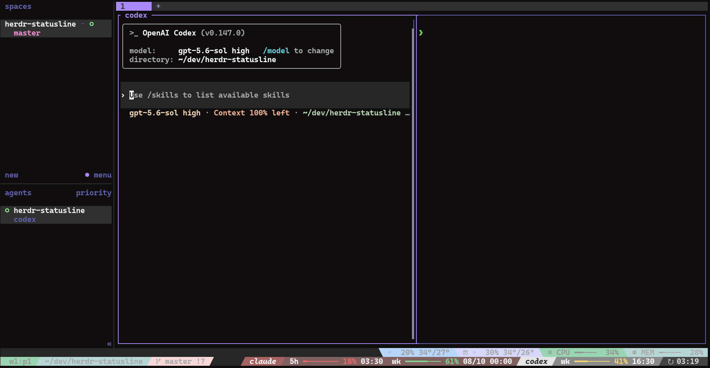

# herdr-statusline

[](https://opensource.org/license/mit/)
[](https://github.com/iiii1224/herdr-statusline)
[](#requirements)

A tmux-compatible status line for `herdr`—easy to migrate, and even easier to customize with your coding agent.

- **Bring your tmux status line with you.** Reuse familiar tmux formats, styles, and `#(...)` shell segments with minimal migration.
- **Customize it by describing what you want.** Your coding agent can edit helper scripts and validate the live configuration for you.




## Requirements

- Linux or WSL
- Herdr 0.7.5 or later
- tmux
- A recent stable Rust toolchain for installation

## Installation & Quick Start

Install the plugin:

```sh
herdr plugin install iiii1224/herdr-statusline
```

Make sure `~/.local/bin` is in `PATH`, then use `hsl` wherever you would use `herdr`:

```sh
hsl                       # Start or attach to the default session
hsl session list          # List available sessions
hsl --session dev         # Attach to the dev session
```

The first interactive launch creates the configuration and the bundled customization skill.

To update, run the install command again. Your configuration and custom scripts are preserved.

```sh
hsl uninstall             # Remove the plugin and hsl; preserve configuration
hsl uninstall --purge     # Also remove the configuration directory
```

## Setup Configuration

Start your coding agent from the plugin configuration directory:

```sh
cd "$(herdr plugin config-dir herdr-statusline)"
codex                     # Or your preferred coding-agent command
```

Then describe the result you want. For example:

```text
Customize my Herdr status line. Keep it minimal: show the focused pane and Git
branch on the left, and the session name and a Tokyo clock on the right. Use a
dark blue theme. Inspect the current setup, implement it, and validate it.
```

The skill is available through both `.agents/skills/` and `.claude/skills/` for broad coding-agent compatibility. Compatible agents can discover and load it when your request matches its description. If your tool does not discover project skills automatically, start the prompt with:

```text
Read .agents/skills/customize-herdr-statusline/SKILL.md, then customize my
Herdr status line.
```

## How It Works

`hsl` wraps interactive Herdr sessions in a disposable tmux session that exists only to draw the status line. Herdr utility and management commands run directly without tmux. Each new `hsl` session loads the configuration returned by:

```sh
herdr plugin config-dir herdr-statusline
```

## Troubleshooting

### Unknown `TERM`

When tmux cannot find the terminal's terminfo entry, `hsl` falls back to `xterm-256color` and prints a notice. Override the fallback with an installed entry:

```sh
HSL_FALLBACK_TERM=rio hsl
```

For a permanent fix, install the terminal's terminfo entry with `tic`.

### Emergency teardown

If a wrapped session becomes unresponsive, kill its disposable tmux server from another terminal:

```sh
ls /tmp/tmux-$(id -u)/ | grep '^hsl-'
tmux -L <socket> kill-server
```

### Kitty graphics protocol

Kitty graphics protocol output is not supported inside the tmux wrapper.
